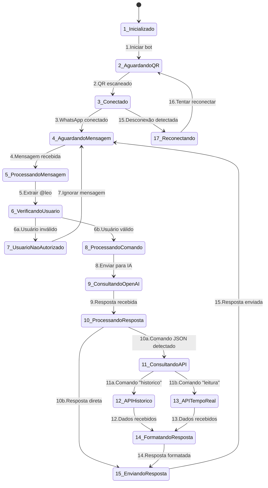
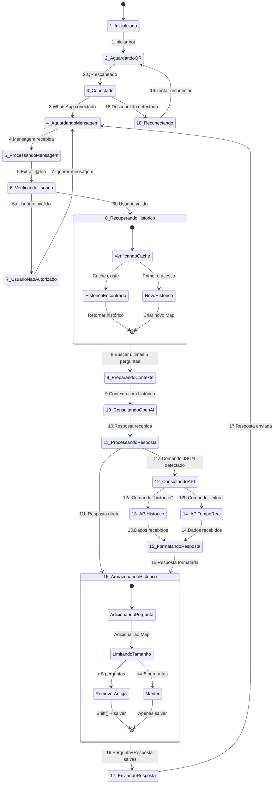
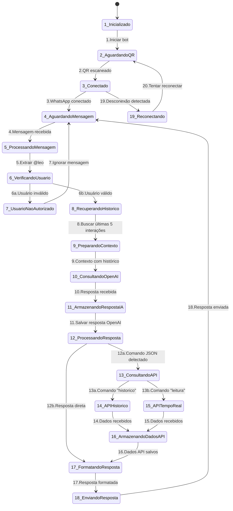

# Estados e Transições do Sistema

##

## claude

## Legenda dos Estados Numerados

| Nº | Estado | Descrição | Log no Código |
|---------|------------|----------------|-------------------|
| **1** | `Inicializado` | Bot iniciado e carregando | `[ESTADO 1] Inicializado` |
| **2** | `AguardandoQR` | Gerando QR Code para conexão | `[ESTADO 2] AguardandoQR` |
| **3** | `Conectado` | WhatsApp conectado com sucesso | `[ESTADO 3] Conectado` |
| **4** | `AguardandoMensagem` | Aguardando mensagens dos usuários | `[ESTADO 4] AguardandoMensagem` |
| **5** | `ProcessandoMensagem` | Mensagem recebida, iniciando processamento | `[ESTADO 5] ProcessandoMensagem` |
| **6** | `VerificandoUsuario` | Verificando se usuário está autorizado | `[ESTADO 6] VerificandoUsuario` |
| **7** | `UsuarioNaoAutorizado` | Usuário não autorizado ou sem @leo | `[ESTADO 7] UsuarioNaoAutorizado` |
| **8** | `ProcessandoComando` | Processando pergunta do usuário | `[ESTADO 8] ProcessandoComando` |
| **9** | `ConsultandoOpenAI` | Enviando pergunta para IA | `[ESTADO 9] ConsultandoOpenAI` |
| **10** | `ProcessandoResposta` | Resposta OpenAI recebida | `[ESTADO 10] ProcessandoResposta` |
| **11** | `ConsultandoAPI` | Comando JSON detectado | `[ESTADO 11] ConsultandoAPI` |
| **12** | `APIHistorico` | Consultando API de dados históricos | `[ESTADO 12] APIHistorico` |
| **13** | `APITempoReal` | Consultando API de dados em tempo real | `[ESTADO 13] APITempoReal` |
| **14** | `FormatandoResposta` | Formatando resposta para envio | `[ESTADO 14] FormatandoResposta` |
| **15** | `EnviandoResposta` | Enviando resposta para WhatsApp | `[ESTADO 15] EnviandoResposta` |

## Fluxos Principais

- **Fluxo Resposta Direta**: 1 → 2 → 3 → 4 → 5 → 6 → 8 → 9 → 10 → 15
- **Fluxo Resposta API Histórico**: 1 → 2 → 3 → 4 → 5 → 6 → 8 → 9 → 10 → 11 → 12 → 14 → 15
- **Fluxo Resposta API Real-Time**: 1 → 2 → 3 → 4 → 5 → 6 → 8 → 9 → 10 → 11 → 13 → 14 → 15

## Prompts

Gravar emojis no historico de contexto, 
